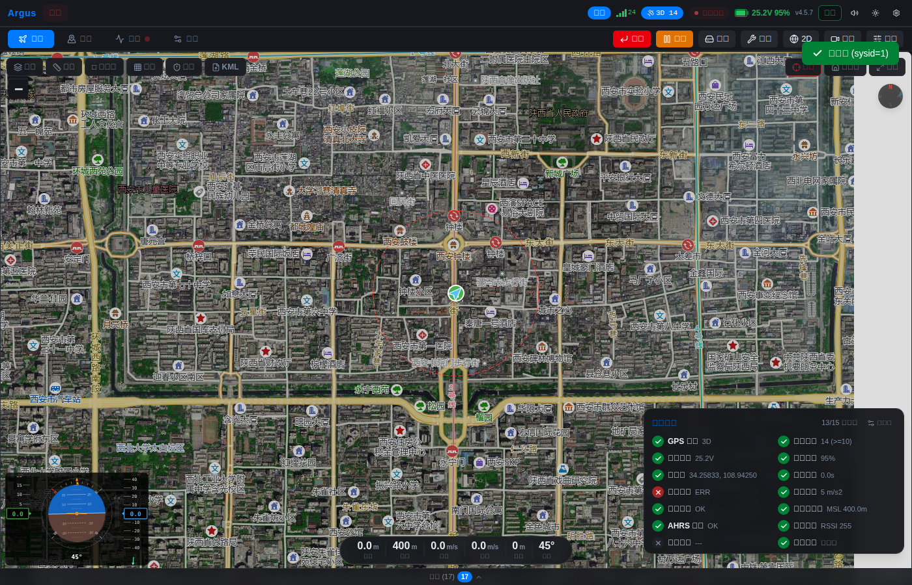

# Argus

[中文](README.zh.md) | **English**

> Universal web-based ground control station for MAVLink drones.

[](https://github.com/L-X-Yao/argus/actions/workflows/ci.yml)

[](LICENSE)


<p align="center"></p>

## What & Why

Argus is a universal **web GCS** — one browser interface for MAVLink drones, on any platform (desktop, tablet, mobile), in 10 languages. No install, no native dependencies, just open a URL and fly.

> **Status**: ArduPilot is production-tested today. PX4 has frontend adapter scaffolding in `src/lib/fc/` and the backend reads `HEARTBEAT.autopilot`, but end-to-end wiring is incomplete — see `CLAUDE.md ## PX4 Status`.

Why another GCS:

| Existing GCS | Limitation |
|---|---|
| QGroundControl | Native app, heavy install, no first-class web build |
| Mission Planner | Windows-only, legacy UI |
| Cloud platforms (FlytBase, ADOS) | Vendor lock-in, closed source |

Argus fills the gap: **open-source + web-native + protocol-agnostic + white-label ready**.

## Features

| Category | Features |
|---|---|
| **Connections** | TCP / UDP / Serial / WebSerial (browser-direct USB, no backend needed for telemetry + basic control) |
| **Protocols** | MAVLink v2 (ArduPilot production-tested; PX4 adapter scaffolded, unwired) |
| **Vehicles** | Copter, Plane, VTOL, Rover, Sub |
| **Map** | 8 tile sources (Amap, Google, OSM, Esri, CartoDB, Tianditu) + 3D terrain (MapLibre GL) + offline mbtiles |
| **Mission** | WP / Spline / Loiter / Survey grid / Crosshatch / Spiral / Orbit + terrain profile with clearance check |
| **Formats** | `.waypoints` (MP) / `.plan` (QGC) / `.gpx` / `.kml` import & export |
| **Parameters** | Metadata-driven UI (desc/range/units/enum/bitmask), tree view, diff export, default reset |
| **Calibration** | Compass, accel, gyro, level, baro wizards with real-time progress |
| **RTK** | NTRIP client with HTTP/1.0 + ICY-200 negotiation, streaming RTCM injection |
| **Firmware** | Upload `.apj`, online firmware browser, reboot to bootloader |
| **Fleet** | Multi-vehicle dashboard with live telemetry per vehicle |
| **Video** | RTSP proxy, AR waypoint overlay, screenshot capture |
| **HUD** | PFD (attitude/speed/altitude/compass/wind), real-time charts, EKF status |
| **Audio** | Bilingual voice callouts (mode, battery, altitude, waypoints) |
| **i18n** | 10 languages (zh, en, ja, ko, de, fr, es, pt, ru, ar) + RTL |
| **Offline** | PWA with service worker, mbtiles support, tile caching (5000-entry LRU) |
| **Desktop** | Tauri v2 packaging (Windows MSI/NSIS installer) |
| **Security** | Token auth, SSRF + path-traversal guards, statustext filtering |

## Quick Start

One-time setup:

```bash
npm install        # Frontend dependencies
pip install -e .   # Backend (uses pyproject.toml — pulls all required deps)
```

### Option 1 — Real hardware (USB to Pixhawk)

```bash
python run.py                  # Backend at http://localhost:8100
# In another shell:
npm run dev                    # Dev server at http://localhost:5173
# Open the URL, plug in USB, pick your serial port from the dropdown
```

For production: `npm run build` builds the bundle into `dist/`, then `python run.py` serves it on `:8100`.

### Option 2 — ArduPilot SITL

```bash
sim_vehicle.py -v ArduCopter --out=udp:127.0.0.1:14550
python run.py
# Open the UI, click the "SITL" quick-connect button
```

### Option 3 — Built-in MAVLink simulator (no FC, no SITL)

```bash
python run.py --sim            # Starts backend + sim_pllink.py together
# Connect to "tcp:localhost:5770"
```

The simulator (`scripts/sim_pllink.py`) emits realistic telemetry (GPS, attitude, battery drain, heartbeat) and responds to arm/disarm/mode commands.

### WebSerial (no backend at all)

Open Argus in Chrome/Edge, click the **USB** button, pick your flight controller. Telemetry, arm/disarm/mode/RTL, param read+write, mission upload/download/clear, fence upload, log list/download, and all 5 calibration types flow directly via WebSerial and the built-in TypeScript MAVLink v2 codec. Firmware upload requires the Python backend.

## Architecture

```
+------------------------------------------+
|  Browser (Svelte 5 + TypeScript 6)       |
|  78 components + 159 libs, 22K lines     |
|  MAVLink v2 codec (pure TS)              |
|  WebSerial direct USB connection         |
|  43 lazy-loaded panels + view splitting  |
+------------------------------------------+
|          WebSocket (JSON delta push)     |
+------------------------------------------+
|  Python Backend (FastAPI + uvicorn)      |
|  29 modules, 4.9K lines                 |
|  MAVLink dispatch + 32 message handlers  |
|  51 commands, tile/video/firmware API    |
+------------------------------------------+
|          MAVLink v2                      |
|  TCP / UDP / Serial / PL-Link           |
+------------------------------------------+
|  Flight Controller (ArduPilot / PX4)     |
+------------------------------------------+
```

### Key modules

| Module | Description |
|---|---|
| `src/lib/mavlink/` | Pure TypeScript MAVLink v2 encoder/decoder with CRC validation |
| `src/lib/fc/` | Flight controller adapter (ArduPilot wired; PX4 mode tables exist, not imported in production) |
| `src/lib/transport.ts` | Dual-mode transport (WebSocket backend vs WebSerial direct) |
| `src/lib/serial.ts` | Web Serial API wrapper with FC USB vendor filters |
| `src/lib/terrain.ts` | SRTM elevation queries for terrain-following missions |
| `src/lib/missionIO.ts` | Mission import/export (`.waypoints` / `.plan` / `.gpx`) |
| `src/lib/survey.ts` | Survey patterns (grid, crosshatch, spiral, orbit) |
| `src/lib/i18n.svelte.ts` | 10-language i18n with RTL support |
| `backend/drone_link.py` | MAVLink connection, frame parsing, state management |
| `backend/commands/` | 51 command handlers (arm, mode, mission, calibration, gimbal, NTRIP, etc.) |
| `backend/config.py` | Centralized configuration (all timeouts/ports/rates) |

## Development

```bash
# Backend unit + contract tests
python -m pytest tests/test_unit_*.py tests/test_contract_*.py -v

# Frontend unit tests
npx vitest run

# Type check (must be 0 errors, 0 warnings)
npx svelte-check --tsconfig ./tsconfig.json

# Python lint
ruff check backend/ scripts/ tests/

# E2E (requires dev server)
npx playwright test

# Production build
npm run build
```

**Git hooks** (auto-installed from `.githooks/`):
- **pre-commit**: ruff + svelte-check (~3s)
- **pre-push**: full vitest + pytest gate

**Deeper docs**:

- [`CLAUDE.md`](CLAUDE.md) — project conventions, PX4 status, protocol-coupling discipline
- [`docs/FEATURE_CHECKLIST.md`](docs/FEATURE_CHECKLIST.md) — feature verification status
- [`docs/protocol_design.md`](docs/protocol_design.md) — load-bearing design decisions
- [`docs/audits/`](docs/audits/) — archived audit reports

## Release

```bash
bash scripts/make-release.sh 3.6.0
```

This single command bumps version across 6 files, commits, tags, and pushes. GitHub Actions then runs the full test gate, builds the Windows package, generates a changelog, and publishes a GitHub Release with artifacts.

Alternatively, to generate a changelog preview locally:

```bash
bash scripts/changelog.sh v3.5.0   # Changes since v3.5.0
```

## Roadmap

**Recently shipped**

- Terrain profile panel with clearance visualization
- In-flight waypoint jump (MISSION_SET_CURRENT)
- WebSerial mission upload/download/clear + fence upload
- WebSerial log list + binary download
- WebSerial all 5 calibration types (compass, accel, gyro, level, baro)
- 3D map waypoint editing, fence drawing, distance/area measure
- NTRIP RTK client (HTTP/1.0 + ICY-200, RTCM streaming)
- Compass/accel/gyro calibration with binary progress
- Multi-language UI (10 locales + RTL)
- Tauri v2 desktop packaging
- Dual-transport mutex (WS backend / WebSerial)
- Gimbal pitch/yaw control
- Tag-triggered release workflow with auto-changelog

**In progress / partial**

- WebSerial firmware upload (APJ parsing + bootloader protocol)
- PX4 end-to-end wiring (backend reads `HEARTBEAT.autopilot`; frontend adapter exists but no code path imports it yet)

**Future**

- WebRTC video streaming (replace RTSP proxy)
- MQTT cloud relay for fleet management
- MAVLink FTP for firmware upload and Lua script management
- MSP protocol support (BetaFlight / iNav)

## Contributing

Issues and PRs welcome. Before sending a PR:

1. Tests pass locally: `npx vitest run && python -m pytest tests/test_unit_*.py tests/test_contract_*.py`
2. Type check is clean: `npx svelte-check` (0 errors, 0 warnings)
3. Python lint is clean: `ruff check backend/ scripts/ tests/`
4. Commit convention: `<type>: <imperative description>` (types: `feat`, `fix`, `refactor`, `test`, `docs`, `ci`, `chore`)
5. For FC-coupled code (MAVLink commands, ACK handling, calibration), cite upstream ArduPilot/PX4 source `file:line` in a comment — see `CLAUDE.md ## Protocol Code Discipline`

## Acknowledgments

Argus stands on the shoulders of:

- [ArduPilot](https://ardupilot.org/) — the flight controller firmware that defines the protocol semantics this GCS targets
- [pymavlink](https://github.com/ArduPilot/pymavlink) — reference MAVLink codec used to validate our pure-TS implementation
- [MAVLink](https://mavlink.io/) — the messaging protocol itself
- [Svelte](https://svelte.dev/), [FastAPI](https://fastapi.tiangolo.com/), [Leaflet](https://leafletjs.com/), [MapLibre GL](https://maplibre.org/), [Tauri](https://tauri.app/) — the application stack
- QGroundControl, Mission Planner, MAVProxy — for showing what's possible

## License

MIT — see [LICENSE](LICENSE).
